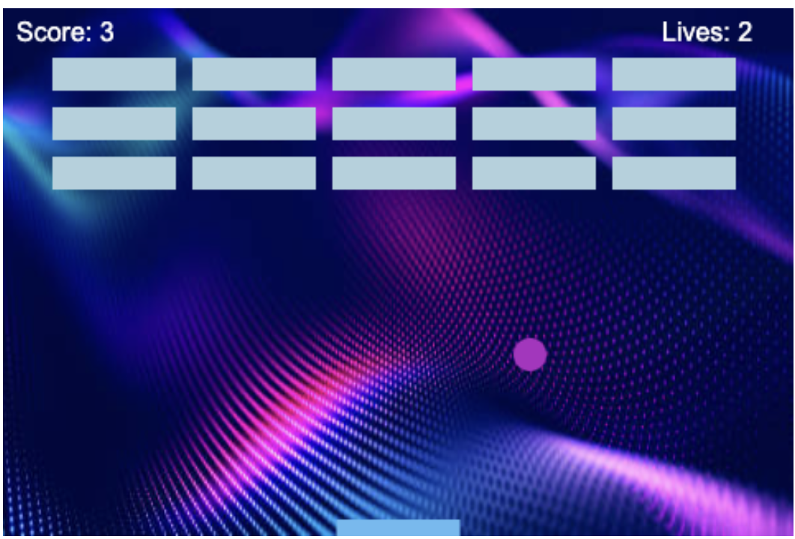

# Breakout Game 🎮

## Description
I built a classic Breakout game using JavaScript, starting with a tutorial and gradually refining the codebase to improve structure and maintainability. Initially, the game was written using procedural programming. However, I refactored the code to follow Object-Oriented Programming (OOP) principles, making it more modular and reusable.  

Throughout this process, I learned how to work with JavaScript functions, variables, arrays, objects, conditionals, and loops. Additionally, I introduced tools like Webpack and TypeScript to enhance the project.  

---
## Why I Made This  

This project was an opportunity to strengthen my JavaScript skills and gain hands-on experience with game development. By following a tutorial and then modifying the code, I was able to:  

- Improve my understanding of the HTML5 Canvas API.  
- Write cleaner and more maintainable JavaScript code using OOP.  
- Implement best practices with linting and bundling.  
- Learn about modern JavaScript build tools like Webpack.  

---

## Screenshots  

  

---

## Getting Started  

### Prerequisites  

Ensure you have Node.js installed on your machine. If not, download and install it from [nodejs.org](https://nodejs.org/).  

### Installation  

1. Clone this repository:  

   ```
   git clone https://github.com/yourusername/breakout-game.git
2. Navigate to the project directory:
    ```
    cd breakout-game
3. Install dependencies:
    ```
    npm install
4. Build the project:
    ```
    npm run build
5. Start a local server to play the game:
    ```
    npm start
6. Alternatively, you can open ```index.html``` directly in your browser.

---

# The Development Process

## Initial Version (Following the Tutorial)
* Followed the [MDN Breakout Game tutorial](https://developer.mozilla.org/en-US/docs/Games/Tutorials/2D_Breakout_game_pure_JavaScript).
* Implemented the game using basic functions and global variables.
## Improvements & Refactoring
* Converted the game logic into classes (Ball, Paddle, Brick, Score, Lives, Background, and Label).
* Used a parent ```Sprite``` class to extend shared functionality among objects.
* Organized constants and game parameters into a separate ```constants.js``` file.
## Enhancements
* Installed and configured ESLint using the Airbnb JavaScript style guide.
* Bundled the game with Webpack for better performance and modularity.
* Introduced TypeScript for static type checking and improved code quality.

---

# Tools and Technologies Used:
* JavaScript (ES6+): Core language for game logic.
* HTML5 Canvas API: Rendered the game graphics.
* CSS: Styled the game elements.
* Webpack: Bundled the JavaScript files.
* ESLint: Ensured code consistency and followed best practices.
* TypeScript: Added optional static typing for better maintainability.

---

# Future Improvements
* Add sound effects for ball collisions and paddle movements.
* Implement different difficulty levels.
* Introduce a start and pause screen.
* Enhance the visuals with animations and new themes.